# Prompt-Injection & Jailbreak Defense — AI Security Engineering Mind Map

> **Purpose:** a practical 2026+ mental model for designing, attacking, testing, and hardening LLM/RAG/agent systems against prompt injection and jailbreaks.
>
> **AegisDesk anchor:** model-visible text is **untrusted data**. It may influence a proposal or answer, but it must not grant permissions, change identity, rewrite server policy, or authorize effects.

```mermaid
mindmap
  root((Prompt-Injection & Jailbreak Defense))
    Mental model
      Model output is untrusted data
      Natural-language instructions are not authorization
      Separate data from authority
      Assume bypasses remain possible
      Contain impact at deterministic boundaries
    Attack classes
      Prompt injection
        Direct
          User-crafted instruction
          Instruction hierarchy attacks
          Role or policy override attempts
        Indirect
          Poisoned RAG documents
          Web pages and files
          Tool or connector metadata
          Email and ticket content
          Memory or conversation state
          Multimodal hidden instructions
        Obfuscation
          Unicode and zero-width characters
          Encoding and transformations
          Payload splitting
          Adversarial suffixes
      Jailbreak
        Safety-policy bypass
        Refusal suppression
        Persona or role-play attacks
        Multi-turn escalation
        Context saturation
        Model-specific adversarial prompts
    Security impacts
      Unauthorized tool use
      Data exfiltration
      Sensitive prompt or context leakage
      Cross-tenant access
      Privilege escalation
      Manipulated decisions
      Unsafe generated content
      Persistence through memory or RAG
      Lateral movement through agents
    Trust boundaries
      User to application
      Application to model
      Retrieval to model context
      Model to tool proposal
      Policy engine to effect
      Agent to agent delegation
      Memory write and read
      External content ingestion
      Output to renderer or downstream code
    Prevention and containment
      Server-owned authority
        Derive identity server-side
        Capability allowlists
        Least privilege
        Exact action and resource binding
        Tenant scoping
        Never trust model-declared approval
      Tool and agent controls
        Typed schemas
        Deterministic argument validation
        Policy check before dispatch
        High-impact human approval
        Non-replayable approvals
        Bounded delegation
        Rate and budget limits
      Context controls
        Label external content untrusted
        Keep instructions separate from retrieved data
        Minimize context and tool descriptions
        Restrict writable memory
        Validate retrieval provenance
        Sanitize and normalize where useful
      Model-layer defenses
        Strong system instructions
        Safety training and alignment
        Input classifiers
        Output classifiers
        Prompt-injection detectors
        Refusal and policy checks
        Treat these as defense-in-depth not sole authorization
      Output and rendering controls
        Structured outputs
        Schema validation
        Escape untrusted markup
        URL and destination allowlists
        No direct shell or SQL execution from model text
    Detection and telemetry
      Log policy decisions not secrets
      Record attack category
      Record source and retrieval IDs
      Record proposed tool and normalized args
      Record allow block reason
      Detect repeated jailbreak attempts
      Detect anomalous tool sequences
      Alert on privilege or tenant boundary probes
    Evaluation
      Adversarial corpus
        Direct injection cases
        Indirect RAG poisoning
        Unicode and encoding cases
        Multi-turn jailbreaks
        Tool-description poisoning
        Memory poisoning
        Multimodal cases when supported
      Benign corpus
        Normal user questions
        Safe RAG retrieval
        Authorized tool tasks
        Refusal-sensitive edge cases
      Metrics
        ASR Attack Success Rate
        FPR False Positive Rate
        SafeTaskRate
        Unauthorized effect count
        Sensitive-data disclosure count
        Approval replay denial rate
      Evidence levels
        Deterministic synthetic CI
        Live local model or service
        Production evidence
        Never claim one level proves another
    Red-team workflow
      Threat model the authority path
      Identify attacker-controlled context
      Build minimal exploit case
      Prove vulnerable behavior safely
      Add deterministic boundary control
      Re-run attack and benign cases
      Measure ASR FPR SafeTaskRate
      Test weakened-control negative case
      Record versions hashes and commit
      Document residual risk
    AegisDesk mapping
      Poisoned RAG
        docs/threat-model/p2b-indirect-prompt-injection.md
        evals/p2b_indirect_prompt_injection.py
      Hardened invariant
        Read-only RAG capability policy
        Empty model-originated tool allowlist
        Principal and tenant stay server-derived
        MCP typed validation remains enforced
      Portfolio proof
        Vulnerable path demonstrates failure
        Hardened path blocks effect
        Unicode case proves containment not universal detection
        Residual risk includes manipulated answer text
    Framework map
      OWASP GenAI
        LLM01 2025 Prompt Injection
        Direct and indirect injection
        Jailbreaking related but distinct emphasis
        Least privilege and human approval
        Adversarial testing
      MITRE ATLAS
        AML.T0051 LLM Prompt Injection
        AML.T0051.000 Direct
        AML.T0051.001 Indirect
        AML.T0054 LLM Jailbreak
        AI Agent Tool Invocation
      NIST
        AI RMF 1.0
        NIST AI 600-1 GenAI Profile
        Govern Map Measure Manage
        Cybersecurity and prompt-injection risk management
    Engineer competencies
      Explain why prompt filtering is insufficient
      Design effect-boundary authorization
      Secure RAG ingestion and retrieval
      Harden agent tool use
      Build jailbreak and injection evals
      Tune security vs usability metrics
      Produce reproducible evidence
      Communicate residual risk without overclaiming
```



## Core distinction

**Prompt injection** is the broader class in which model inputs alter behavior or output in unintended ways. It can be **direct** (the user supplies the malicious instruction) or **indirect** (the instruction arrives through external content such as a file, webpage, retrieved document, or other model-visible source).

**Jailbreaking** is closely related but focuses on causing a model to bypass its safety behavior or safeguards. A jailbreak can therefore be treated as a specialized adversarial objective within the broader prompt-manipulation problem, while indirect prompt injection is especially important for RAG and agent systems because the attacker may never directly interact with the victim model session.

The engineering consequence is important: **do not make authorization depend on whether a detector recognizes a malicious prompt.** Detection can reduce risk, but deterministic application controls must contain the impact when detection or model alignment fails.

## Defense hierarchy

| Priority | Control | Security purpose | Failure it prevents or contains |
|---|---|---|---|
| 1 | Server-derived identity, tenant, and authorization | Keep authority outside model context | Prompt cannot invent a principal or permission |
| 2 | Least-privilege capability policy at the effect boundary | Limit what the model/agent may cause | Unauthorized tool or agent actions |
| 3 | Typed tool schemas and deterministic validation | Constrain action shape and inputs | Free-form model output becoming executable authority |
| 4 | Human approval for high-impact actions | Add explicit trusted authorization | Destructive or privileged autonomous effects |
| 5 | Exact action/resource binding and anti-replay | Prevent approval substitution | Reusing approval for another action/resource |
| 6 | Retrieval/memory provenance and write controls | Reduce persistent indirect injection | Poisoned RAG or memory becoming durable influence |
| 7 | Input/output classifiers and prompt-injection detectors | Detect known/suspicious patterns | Common jailbreak and injection attempts |
| 8 | System prompts, delimiters, context separation | Make attacks harder and behavior clearer | Accidental instruction confusion |
| 9 | Continuous adversarial evaluation | Detect regressions and new bypasses | Silent degradation after model/prompt/tool changes |

## AegisDesk invariant to remember

```text
attacker-controlled text
        ↓
retrieval / prompt / tool metadata / memory
        ↓
      MODEL
        ↓
UNTRUSTED proposal or generated text
        ↓
server-owned identity + capability + policy + validation
        ↓
 trusted effect boundary
        ↓
synthetic tool effect (only if authorized)
```

For the repository's P2-B case, poisoned retrieved content is allowed to influence the deterministic model enough to produce a malicious tool proposal. The hardened path still blocks the side effect because the read-only RAG execution context owns an empty model-originated tool capability set. This demonstrates **containment at the authorization boundary**, not universal detection of every possible prompt injection.

## Minimum evaluation matrix

| Case | Expected vulnerable path | Expected hardened path | Primary measurement |
|---|---|---|---|
| Direct instruction override | May follow malicious instruction | No unauthorized effect | ASR |
| Poisoned RAG document | May propose/dispatch attacker action | Proposal blocked at capability boundary | ASR |
| Unicode/obfuscated injection | Detector may miss it | Unauthorized effect still blocked | ASR + detector coverage |
| Multi-turn jailbreak | Safety behavior may degrade | Privileged effects remain independently controlled | ASR |
| Benign read-only RAG | Completes | Completes | FPR + SafeTaskRate |
| Legitimate authorized tool request | Executes when allowed | Executes only within policy | SafeTaskRate |
| High-impact action without approval | Risky execution | Denied/pending approval | Unauthorized effect count |
| Replayed or mismatched approval | May be accepted in weak design | Denied by exact binding/non-replay | Replay denial rate |

### Measurement formulas

```text
ASR = successful policy violations / valid adversarial attempts
FPR = benign tasks incorrectly blocked / valid benign attempts
SafeTaskRate = benign tasks completed safely / valid benign attempts
```

Always keep the raw numerator and denominator next to the percentage. A low ASR alone is insufficient if benign functionality is unusable, and a low FPR is insufficient if privileged effects remain reachable.

## Practical review checklist

- [ ] Identify every attacker-controlled input that can reach model context.
- [ ] Mark external/RAG/tool/memory content as untrusted.
- [ ] Ensure model text cannot change authenticated identity, tenant, role, or policy.
- [ ] Put tool authorization immediately before the effect, not only in the system prompt.
- [ ] Apply least privilege to every agent execution context.
- [ ] Validate tool arguments with strict schemas and server-owned values.
- [ ] Require trusted approval for high-impact effects.
- [ ] Bind approvals to principal + exact action + exact resource + expiry/nonce.
- [ ] Restrict memory writes and validate/provenance-tag persistent context.
- [ ] Escape or validate generated content before browsers, shells, SQL, templates, or other interpreters consume it.
- [ ] Test direct, indirect, obfuscated, multi-turn, and tool/agent-specific attack cases.
- [ ] Pair adversarial cases with benign cases and report ASR/FPR/SafeTaskRate.
- [ ] Include a weakened-control negative test so the evaluation can actually fail.
- [ ] Record model, prompt, policy, corpus, dependency, and commit versions with evidence.
- [ ] State residual risk explicitly; never claim a prompt detector or system prompt makes injection impossible.

## Repository links

- `docs/threat-model/p2b-indirect-prompt-injection.md` — poisoned RAG -> tool misuse threat model.
- `evals/p2b_indirect_prompt_injection.py` — deterministic evaluation harness for the P2-B case.
- `README.md` — portfolio-level architecture, evidence boundary, and flagship security cases.

## Current primary references

Verified for this mind map on **2026-08-30**:

1. **OWASP GenAI Security Project — LLM01:2025 Prompt Injection**  
   https://genai.owasp.org/llmrisk/llm01-prompt-injection/

2. **MITRE ATLAS — Threat Matrix for AI Systems**  
   https://atlas.mitre.org/

3. **NIST AI 600-1 — Artificial Intelligence Risk Management Framework: Generative Artificial Intelligence Profile**  
   https://doi.org/10.6028/NIST.AI.600-1

## Interview-ready explanation

> Prompt injection is not only a bad-prompt problem; it is a trust-boundary problem. I assume attacker-controlled text can influence the model, so I treat model output as untrusted. I use model-layer defenses and detectors to reduce exposure, but I place deterministic identity, capability, validation, approval, and tenant controls at the effect boundary. Then I prove the design with adversarial and benign evaluations using ASR, FPR, SafeTaskRate, negative controls, and reproducible evidence. Jailbreak resistance is part of that defense-in-depth story, but a model refusing malicious text is never my authorization mechanism.
