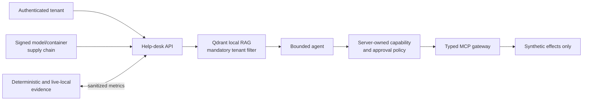

# AegisDesk

AegisDesk is a safe, synthetic AI-security engineering lab for attacking and hardening a multi-tenant help-desk RAG agent across retrieval, MCP tools, multi-agent workflows, model supply chain, training, and inference. It pairs intentionally vulnerable comparisons with server-owned controls and reproducible evidence; it is a portfolio demonstration, not a production product or an attack platform.

## Verified boundary

The current portfolio claim is **P11-E implemented with deterministic and bounded live-local evidence as recorded in the repository**. P11-F code and progress records exist, but this README deliberately stops its headline claim at the requested P11-E boundary. Deterministic tests do not prove model behavior or factual correctness; live-local labs do not prove cloud, GPU, multi-node, or production operation.



## Flagship case studies

- **Indirect prompt injection and MCP authority:** poisoned retrieval and tool metadata can influence a model proposal, but cannot expand the host-owned tool allowlist, tenant, or principal. [Threat model](docs/threat-model/p2b-indirect-prompt-injection.md) · [evaluation](evals/p2b_indirect_prompt_injection.py)
- **Multi-agent delegation and human approval:** delegation preserves original-principal authority; high-impact actions require evidence-bound, non-replayable approval. [Threat model](docs/threat-model/p8f-human-handoff-approval-autonomy-boundary-security.md) · [evaluation](evals/p8f_human_approval.py)
- **Model/container supply chain:** immutable subjects, provenance, signatures, SBOM/scanner binding, quarantine, and signer rotation are evaluated without treating a signature as content safety. [Threat model](docs/threat-model/p11e-supply-chain-security.md) · [evaluation](evals/p11e_supply_chain_security.py)
- **Training and inference tenant isolation:** training lineage and shared inference state bind tenant, model, adapter, cache, and request identity. [Training model](docs/threat-model/p9i-phase9-integrated-exit-gate.md) · [inference model](docs/threat-model/p10a-inference-tenant-state-isolation.md)

| Attack | Vulnerable behavior | Hardened control | Measurement |
|---|---|---|---|
| Retrieved/MCP instruction requests a tool | Model-visible text becomes authority | Typed proposal plus server capability policy | ASR, FPR, SafeTaskRate |
| Delegated agent changes actor/action | Caller-declared approval is accepted | Original-principal and exact-action binding | ASR, approval replay denials |
| Mutable or poisoned release is promoted | Tag/signature alone is trusted | Digest, provenance, SBOM, scan, admission, quarantine | Incorrect allows/denies |
| Cross-tenant state is reused | Caller route or shared cache is trusted | Server tenant filter and immutable runtime bindings | ASR, FPR, SafeTaskRate |

## Quick start

```bash
python -m pip install -e ".[dev]"
python -m pytest tests/security/test_portfolio_gap_controls.py
python scripts/run_portfolio_demo.py
python -m real_model_evals                 # offline fake, explicitly labeled
python -m real_model_evals --live          # opt-in; BLOCKED if unconfigured
```

Evidence legend: **deterministic** = synthetic fake/no-model or modeled execution suitable for CI; **live-local** = an actually executed bounded local service, process, container, or cluster; **production** = real deployment evidence, currently not claimed.

## Current limitations

No paid model is required or silently substituted for a live pass. Real-model, multimodal, NVIDIA GPU/MIG/CUDA, production cloud IAM/KMS/HSM, multi-node Kubernetes, production registry/SIEM/SOC, and production-scale reliability remain unverified or deferred. Heuristic groundedness checks establish citation/evidence structure, not truth. Intentionally vulnerable components are local synthetic comparisons and must never be exposed publicly.

See the [portfolio gap closure](docs/portfolio-gap-closure.md), [framework crosswalk](docs/framework-crosswalk.md), [threat models](docs/threat-model/), [evaluations](evals/), and [security tests](tests/security/). Historical milestone detail remains in `docs/phase*-progress.md`.

## What I learned and can explain in an interview

I can explain why model output is untrusted data, why authorization belongs at the effect boundary, how tenant filters and evidence provenance fail, how to measure ASR/FPR/SafeTaskRate from raw attempts, and why deterministic, live-local, and production evidence are different claims.
