# Prompt-Injection & Jailbreak Defense — AI Security Engineer Mind Map (2026+)

> **Goal:** build the mental model and hands-on skills needed to design, test, harden, and explain LLM/agent defenses against prompt injection and jailbreaks.
>
> **Core invariant:** **model-visible content and model output are untrusted data, not authority.** A model may propose an action; server-owned identity, authorization, policy, validation, and approval decide whether an effect is allowed.

This mind map is intentionally defensive and lab-oriented. It complements AegisDesk's existing [P2-B indirect prompt-injection threat model](../threat-model/p2b-indirect-prompt-injection.md) and its deterministic security evaluations.

```mermaid
mindmap
  root((Prompt-Injection & Jailbreak Defense\nAI Security Engineer 2026+))
    1. Threat Model
      Direct prompt injection
        User-controlled instructions
        Role or instruction override attempts
        Prompt extraction attempts
      Jailbreak
        Safety-policy circumvention
        Obfuscation and encoding
        Adversarial suffixes
        Multi-turn manipulation
        Multilingual variants
      Indirect prompt injection
        RAG documents
        Web pages
        Email and tickets
        Tool or MCP metadata
        Agent messages
        Memory entries
        Images and multimodal content
      Agentic escalation
        Goal hijacking
        Tool misuse
        Context poisoning
        Memory poisoning
        Cross-agent propagation
      Security impact
        Confidentiality
        Integrity
        Availability
        Unauthorized effects
        Data exfiltration
        Policy bypass
    2. Trust Boundaries
      User input is untrusted
      Retrieved content is untrusted
      Tool descriptions can be untrusted
      Model output is untrusted
      External agents are untrusted peers
      Memory writes need validation
      Server identity is authoritative
      Server policy is authoritative
      Effect boundary is authoritative
    3. Architecture Defenses
      Separate data from authority
      Least privilege
      Capability-based tool access
      Server-side authorization
      Typed tool schemas
      Deterministic policy checks
      Tenant and principal binding
      Egress restrictions
      Sandboxing and isolation
      Human approval for high-impact actions
      Fail closed on ambiguous authorization
    4. Prompt and Context Controls
      Clear instruction hierarchy
      Delimit untrusted context
      Label source provenance
      Minimize unnecessary context
      Normalize suspicious encodings
      Detect obvious injection patterns
      Treat detectors as supplemental
      Never place secrets in prompts unnecessarily
      Prevent retrieved text from changing policy
      Isolate system-owned instructions
    5. RAG Defense
      Trusted ingestion pipeline
      Document provenance
      Tenant-scoped retrieval
      Content quarantine
      Poisoning review workflow
      Chunk and metadata validation
      Retrieval relevance checks
      Context source citations
      No authority from retrieved text
      Regression corpus for poisoned documents
    6. Agent and Tool Defense
      Model proposes, host disposes
      Explicit tool allowlist
      Per-task capability set
      Argument validation
      Resource-level authorization
      Original-principal preservation
      No caller-declared privilege
      Approval bound to exact action
      Non-replayable approvals
      Bounded loops and budgets
      Restricted network destinations
      Separate read and write tools
    7. Output Defense
      Treat generated output as tainted
      Schema validation
      Output encoding
      Safe rendering
      URL and protocol restrictions
      No direct shell or SQL execution
      Validate code before execution
      Redact sensitive data
      Block unsafe side effects
    8. Detection and Telemetry
      Prompt and context provenance
      Tool proposal logs
      Policy decision logs
      Block reason taxonomy
      Retrieval document IDs
      Model and prompt version
      Suspicious encoding signals
      Cross-agent propagation signals
      Egress attempts
      Approval events
      Privacy-preserving evidence
    9. Adversarial Evaluation
      Baseline benign tasks
      Direct injections
      Indirect injections
      Obfuscated variants
      Payload splitting
      Long-context attacks
      Multi-turn jailbreaks
      Multilingual attacks
      Multimodal attacks
      RAG poisoning
      Tool-description poisoning
      Memory poisoning
      Adaptive attacks
      Model-upgrade regression
    10. Security Metrics
      ASR
        Successful policy violations / valid adversarial attempts
      FPR
        Benign tasks incorrectly blocked / benign attempts
      SafeTaskRate
        Benign tasks completed safely / benign attempts
      Tool violation rate
      Unauthorized-effect count
      Sensitive-data leakage rate
      Detection precision and recall
      Mean time to detect
      Mean time to contain
      Coverage by attack family
    11. Incident Response
      Contain tool access
      Revoke credentials
      Disable compromised data source
      Quarantine poisoned content
      Preserve evidence
      Identify affected principals and tenants
      Rotate prompts or policies only when justified
      Patch effect-boundary control
      Re-run adversarial regression suite
      Document residual risk
    12. Framework Mapping
      OWASP GenAI LLM Top 10 2026
      OWASP LLM01 Prompt Injection
      OWASP Agentic Top 10 2026
      NIST AI 100-2e2025
      NIST AI 600-1
      MITRE ATLAS
        LLM Prompt Injection
        LLM Jailbreak
        RAG Poisoning
        Agent Context Poisoning
        Tool Invocation
    13. Portfolio Skills
      Threat modeling
      Secure RAG
      Secure agent architecture
      MCP and tool authorization
      Red-team harnesses
      Security regression tests
      Metrics and evidence
      Detection engineering
      Incident response
      Framework crosswalks
      Clear interview explanations
```



## What to understand deeply

### 1. Prompt injection and jailbreak are related, but not identical

OWASP defines prompt injection as input that changes an LLM's behavior or output in unintended ways. It distinguishes **direct** injection from **indirect** injection through external content such as files or web pages, and describes **jailbreaking** as a form of prompt injection intended to bypass model safety behavior. RAG and fine-tuning do **not** eliminate the problem.

For an engineer, the practical consequence is: **do not make system security depend on the model always recognizing malicious instructions.** Detection and model alignment are useful layers, but they must sit behind hard application controls.

### 2. The strongest boundary is outside the model

Use this decision pattern:

```text
untrusted user/context
        |
        v
      model
        |
        v
  typed proposal  <--- still untrusted
        |
        v
server-owned identity + authorization + policy + validation
        |
        +---- deny / require approval
        |
        v
   bounded effect
```

The model can influence a **proposal**, but it cannot grant itself a tool, change the authenticated principal, expand a tenant boundary, approve its own high-impact action, or choose unrestricted network destinations.

This is the same principle already demonstrated by AegisDesk P2-B: retrieved content can influence the model proposal, but cannot expand the host-owned capability boundary.

## Attack surface -> primary control

| Attack surface | What can go wrong | Primary defensive control |
|---|---|---|
| Direct user prompt | Instruction override or jailbreak | Model safeguards + input monitoring + server-side policy |
| Retrieved RAG document | Hidden/visible instructions become model context | Provenance + untrusted-context handling + effect-boundary authorization |
| Web/email/ticket content | Indirect injection and exfiltration attempts | Content isolation + restricted tools/egress + output controls |
| Tool/MCP metadata | Poisoned descriptions steer tool use | Trusted tool registry + server allowlists + typed schemas |
| Agent-to-agent message | Compromised agent redirects workflow | Mutual identity + scoped delegation + policy at every hop |
| Long-term memory | Poisoned instruction persists | Validated writes + provenance + tenant isolation + TTL/review |
| Model output rendering | Generated HTML/Markdown/URLs trigger effects | Safe renderer + URL/protocol allowlists + output encoding |
| Generated code/commands | Model output reaches interpreter | Sandbox + validation + explicit approval + no raw privileged execution |

## Defense stack

A mature implementation should have multiple independent layers:

1. **Model layer** — instruction hierarchy, alignment, jailbreak resistance, optional safety models.
2. **Input/context layer** — normalization, provenance, separation of trusted instructions from untrusted data, injection detection.
3. **Retrieval layer** — tenant filtering, ingestion controls, document provenance, poison quarantine, source-aware context.
4. **Agent layer** — bounded planning, preserved principal, scoped delegation, no model-created authority.
5. **Tool layer** — explicit allowlists, typed arguments, resource-level authorization, minimum privilege.
6. **Effect layer** — deterministic policy, human approval for high-impact actions, transaction boundaries, egress controls.
7. **Output layer** — encoding, rendering restrictions, data-loss controls, schema checks.
8. **Detection layer** — decision logs, provenance, anomalies, blocked proposals, exfiltration indicators.
9. **Evaluation layer** — adversarial regression tests plus matched benign tasks to measure security **and** usability.
10. **Governance layer** — threat models, control ownership, change review, incident response, evidence-backed claims.

## Metrics you should be able to calculate

```text
ASR = successful policy violations / valid adversarial attempts

FPR = benign attempts incorrectly blocked / total benign attempts

SafeTaskRate = benign tasks completed safely / total benign attempts
```

Do not report only "blocked attacks." A useful security claim needs raw numerators/denominators, attack coverage, benign controls, versions, and a clearly stated evidence boundary.

## 2026+ hands-on portfolio path

Use AegisDesk to turn the map into evidence. Implement each item in a **local/synthetic authorized lab**, with a vulnerable comparison only when needed to prove the control.

- [x] **Indirect RAG prompt injection -> tool misuse:** existing [P2-B threat model](../threat-model/p2b-indirect-prompt-injection.md) and `evals/p2b_indirect_prompt_injection.py`.
- [ ] **Direct jailbreak evaluation:** benign + adversarial suite; measure refusal/security behavior without treating refusal alone as an authorization control.
- [ ] **Tool-description poisoning:** malicious MCP/tool metadata influences a proposal, while the host-owned registry and allowlist prevent unauthorized execution.
- [ ] **Web/email indirect injection:** untrusted external content attempts data exfiltration; egress and effect-boundary controls contain it.
- [ ] **Memory poisoning:** attacker-controlled content attempts to become persistent instruction; memory writes require provenance, schema, tenant binding, and review policy.
- [ ] **Multi-agent context poisoning:** compromised agent message attempts privilege or goal escalation; original principal and scoped delegation survive every hop.
- [ ] **Multimodal injection:** text hidden in an image or attachment is treated as untrusted context and cannot grant authority.
- [ ] **Adaptive regression suite:** encoding, Unicode, multilingual, payload-splitting, long-context, and model-version variations.
- [ ] **Detection engineering:** produce privacy-preserving events for injection indicators, blocked tool proposals, policy failures, and suspicious egress.
- [ ] **Incident drill:** poison a synthetic knowledge item, detect it, quarantine it, revoke related capability, preserve evidence, patch the boundary, and prove regression tests pass.

## Interview-level explanations to master

You should be able to explain, with code and evidence:

- Why a stronger system prompt is **not** a complete security boundary.
- Why prompt-injection detection is useful but cannot be the only control.
- Why retrieved content, tool metadata, memory, and agent messages must be treated as untrusted.
- Why the model should propose actions while deterministic application code authorizes them.
- Why least privilege and resource-level authorization limit jailbreak blast radius.
- Why human approval must be bound to the exact principal, action, resource, and parameters.
- Why RAG can increase the indirect-injection surface instead of automatically solving it.
- How ASR, FPR, and SafeTaskRate prevent misleading "100% blocked" claims.
- How to distinguish deterministic lab evidence, live-model evidence, and production assurance.
- How OWASP, NIST, and MITRE ATLAS describe overlapping parts of the same threat landscape.

## Primary references

Verified for this mind map on **2026-08-30**:

1. **OWASP GenAI LLM Top 10 2026** — latest OWASP LLM/GenAI risk guide as of this update: https://genai.owasp.org/resource/owasp-genai-llm-top-10-2026/
2. **OWASP LLM01:2025 Prompt Injection** — direct/indirect injection, jailbreak relationship, RAG risk, least privilege, human approval, content segregation, adversarial testing: https://genai.owasp.org/llmrisk/llm01-prompt-injection/
3. **OWASP Top 10 for Agentic Applications 2026** — agentic risks and defensive framing for autonomous workflows: https://genai.owasp.org/resource/owasp-top-10-for-agentic-applications-for-2026/
4. **NIST AI 100-2e2025 — Adversarial Machine Learning: A Taxonomy and Terminology of Attacks and Mitigations** — query/resource control, jailbreaks, indirect prompt injection, RAG attacks, and defense-in-depth: https://nvlpubs.nist.gov/nistpubs/ai/NIST.AI.100-2e2025.pdf
5. **NIST AI 600-1 — Artificial Intelligence Risk Management Framework: Generative AI Profile** — generative-AI risk management including direct and indirect prompt injection: https://nvlpubs.nist.gov/nistpubs/ai/NIST.AI.600-1.pdf
6. **MITRE ATLAS** — living adversarial AI knowledge base covering LLM Prompt Injection, LLM Jailbreak, RAG poisoning, agent context/tool poisoning, exfiltration, and related techniques: https://atlas.mitre.org/

## Rule to remember

> **Assume prompt injection will sometimes reach the model. Engineer the system so that reaching the model is not enough to cross an authorization, data, tenant, network, or high-impact effect boundary.**
