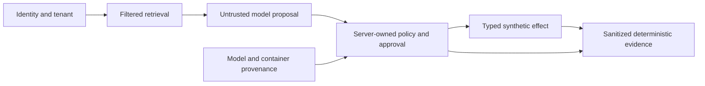

# Verify AegisDesk in five minutes

AegisDesk demonstrates how a multi-tenant help-desk RAG agent can treat model output, retrieved text, delegated actions, artifacts, and infrastructure signals as untrusted inputs. Its server-owned controls bind identity, tenant, authority, evidence, and effects. The proof here is deterministic local evidence, not a production-readiness claim.



## Four flagship cases

| Case | Threat and vulnerable behavior | Implemented control | Source and validation | Measurable evidence | Honest limitation |
|---|---|---|---|---|---|
| Indirect prompt injection | Retrieved or MCP text becomes authority and triggers an attacker-selected tool. | Typed proposals are checked against server-owned tenant and capability policy before effects. | [`aegis/rag/evaluation.py`](../aegis/rag/evaluation.py); [`test_portfolio_gap_controls.py`](../tests/security/test_portfolio_gap_controls.py); `evals.portfolio_adaptive_security` | Vulnerable ASR 14/14; hardened ASR 0/14; FPR 0/2; SafeTaskRate 2/2. | Synthetic corpus and structural groundedness do not prove factual correctness or real-model behavior. |
| Multi-agent approval | A delegate substitutes the principal/action or replays approval. | Original-principal, exact-action, evidence, expiry, and one-time-use bindings guard the effect boundary. | [`aegis/agentic/human_approval_security.py`](../aegis/agentic/human_approval_security.py); [`test_p8f_human_approval.py`](../tests/security/test_p8f_human_approval.py); `evals.p8f_human_approval` | Vulnerable ASR 92/92; hardened ASR 0/92; FPR 0/3; SafeTaskRate 3/3. | Modeled local workflows are not production identity-provider or SOC validation. |
| Model/container supply chain | Mutable, poisoned, or mismatched artifacts are promoted because a tag or signature alone is trusted. | Digest, provenance, signer, SBOM, scanner, admission, quarantine, and rotation bindings are evaluated together. | [`aegis/model_supply_chain/`](../aegis/model_supply_chain/); [`test_p11e_supply_chain_security.py`](../tests/security/test_p11e_supply_chain_security.py); `evals.p11e_supply_chain_security` | Hardened ASR 0/45; FPR 0/15; SafeTaskRate 15/15; dataset hash retained in the evidence sample. | A deterministic fixture is not a production registry, KMS/HSM, or live cluster attestation. |
| Inference tenant isolation | Caller-selected routing or shared cache/adapter state crosses tenant boundaries. | Server-owned tenant, request, model, adapter, cache, replica, and runtime bindings reject stale or cross-tenant reuse. | [`aegis/inference/`](../aegis/inference/); [`test_p10a_inference_tenant_isolation.py`](../tests/security/test_p10a_inference_tenant_isolation.py); `evals.p10a_inference_tenant_isolation` | Vulnerable ASR 136/136; hardened ASR 0/136; FPR 0/4; SafeTaskRate 4/4. | No GPU/MIG/CUDA, cloud, multi-node, or production serving validation is claimed. |

Metrics are derived from bounded fixtures. ASR is attack success rate, FPR is false-positive rate, and SafeTaskRate is the fraction of legitimate tasks allowed. Review the [real generated sample](evidence/portfolio-demo-report.md) and its dataset hashes.

## Run it

From the repository root:

```bash
python scripts/run_portfolio_demo.py --output-dir /tmp/aegisdesk-portfolio-demo
python -m pytest -q tests/security/test_portfolio_gap_controls.py tests/security/test_portfolio_demo_evidence.py
```

The demo uses no network or external effects. It writes JSON and Markdown only to the requested temporary directory. Regenerate the sanitized committed sample with:

```bash
python scripts/run_portfolio_demo.py --output-dir /tmp/aegisdesk-portfolio-demo --docs-sample
```

Exit-state vocabulary:

- `VERIFIED` (exit 0): all bounded deterministic assertions passed.
- `FAILED` (nonzero): a required control, metric, or evidence assertion failed.
- `BLOCKED` (exit 2 for optional live-model evaluation): requested live evidence lacks explicit opt-in or configuration; it is not treated as a pass.

Deterministic local evidence supports reproducibility and regression detection. It does not verify real-model correctness, production SOC/SIEM operation, live Kubernetes, GPU/cloud/HSM controls, production scale, or production readiness.

## Interview prompts

- Why does authority remain server-owned when a model proposes a valid-looking action?
- How do ASR, FPR, and SafeTaskRate expose both security and usability regressions?
- Why is a signature necessary but insufficient for model supply-chain trust?
- What evidence would be required to move a claim from deterministic to live-local or production?
